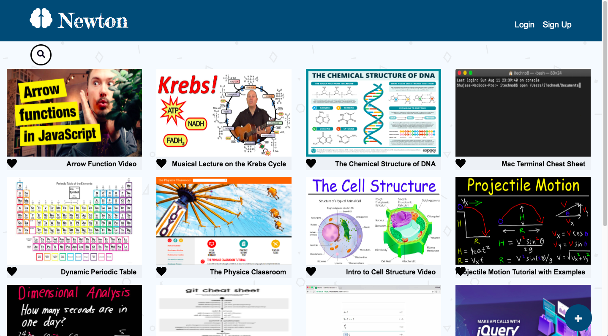
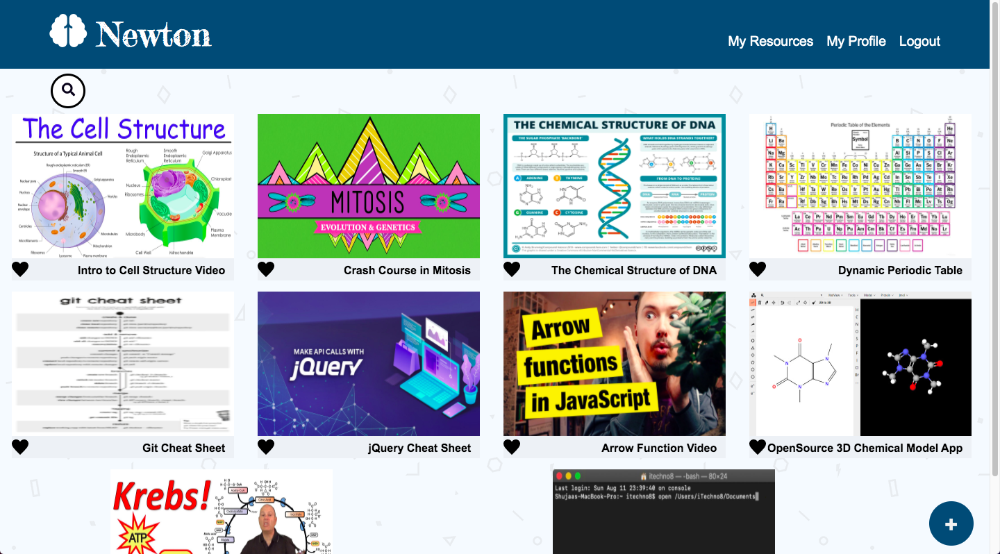
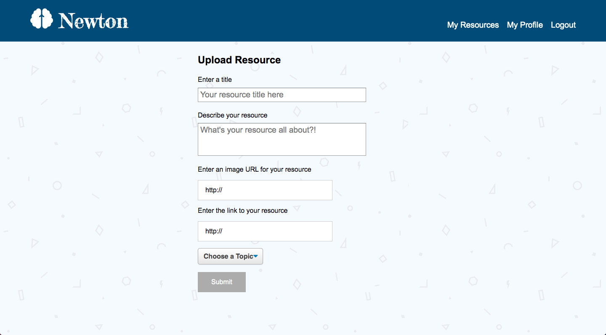

# Newton 

Pinterest-like app for learners that allows learners to save learning resources like tutorials, blogs and videos in a central place that is publicly available to any user.

Search community resources or topics, comment on and rate resources, or upload your own!

User signup and authentication is fully supported through cookies.

## Utilized
Node.js/Express RESTful API, PostgreSQL, CookieParser, Material UI, Styled-components

## Screenshots

